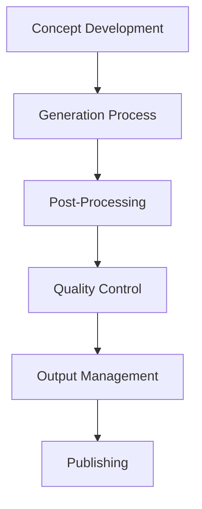
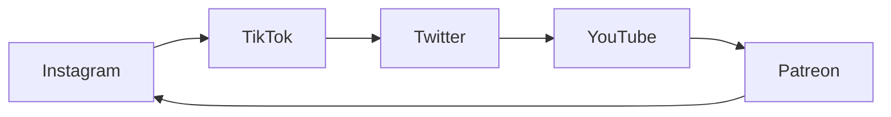

# AI Character Creation & Monetization Plan

> **Version 0.1.0** - A comprehensive roadmap for software engineers entering the AI character market

## Table of Contents
- [Overview](#overview)
- [Phase 1: Foundation & Planning](#phase-1-foundation--planning)
- [Phase 2: Technical Setup](#phase-2-technical-setup)
- [Phase 3: Platform & Content Strategy](#phase-3-platform--content-strategy)
- [Phase 4: Monetization & Growth](#phase-4-monetization--growth)
- [Tools & Resources](#tools--resources)
- [Timeline Overview](#timeline-overview)
- [Success Metrics](#success-metrics)
- [Common Pitfalls](#common-pitfalls)
- [Budget Considerations](#budget-considerations)

---

## Overview

> *"The future of content creation lies at the intersection of artificial intelligence and human creativity."*

This comprehensive guide outlines the **step-by-step process** to create, develop, and monetize an AI-generated character for content creation and business purposes. The plan is specifically designed for **software engineers with basic image generation knowledge** who want to enter the rapidly growing AI character market.

### 🎯 Target Outcomes

- ✅ **Establish** a consistent AI character with strong brand identity
- 📈 **Build** engaged social media following across multiple platforms  
- 💰 **Generate** sustainable revenue through multiple monetization streams
- ⚡ **Create** scalable content creation workflow

> **💡 Pro Tip**: Success in the AI character space requires consistency, creativity, and continuous learning. This guide provides the roadmap, but your dedication determines the destination.

---

## Phase 1: Foundation & Planning
**⏱️ Duration: Week 1-2**

> *"A character without a clear identity is like a ship without a compass."*

### 1.1 Market Research & Domain Selection

#### 🎨 Choose Your Niche

| **Niche Type** | **Audience** | **Monetization Potential** | **Difficulty** |
|----------------|--------------|---------------------------|----------------|
| **Anime/Manga Style** | Young adults (18-25) | High - Merchandising, collectibles | Medium |
| **Realistic Portraits** | General audience (25-45) | Very High - Brand partnerships | High |
| **Fantasy/Sci-Fi** | Gaming community (20-35) | Medium - Niche but loyal | Low |
| **Artistic/Abstract** | Art collectors (30+) | High - NFTs, exclusive art | High |

> **⚠️ Important**: Choose a niche you're genuinely passionate about. Authenticity resonates with audiences, even in AI-generated content.

#### 📊 Market Analysis Tasks

```markdown
Research Checklist:
□ Research top 20 AI characters in your chosen domain
□ Analyze their follower counts, engagement rates, content types
□ Identify gaps in the market or underserved audiences
□ Study successful monetization strategies in your niche
□ Survey potential target demographics
```

#### 🌐 Platform Research

> **Platform Strategy**: *"Don't try to be everywhere at once. Master one platform before expanding."*

- **Instagram**: 📸 Visual-first platform, high engagement potential
- **TikTok**: 🎵 Viral content opportunities, younger demographics
- **Twitter/X**: 💬 Real-time interaction, personality development
- **OnlyFans/Patreon**: 💰 Direct monetization, subscription model
- **YouTube**: 🎥 Long-form content, ad revenue potential

### 1.2 Character Development

#### 🧬 Core Character Profile

```yaml
Character Blueprint:
  name: "Choose memorable, searchable name"
  age: "Target demographic alignment"
  background: "Relatable backstory with cultural context"
  personality_traits:
    - trait_1: "Primary characteristic"
    - trait_2: "Secondary characteristic"
    - trait_3: "Unique quirk"
  interests: ["hobby_1", "hobby_2", "hobby_3"]
  values: ["value_1", "value_2"]
  usp: "What makes them different from competitors"
```

> **🎭 Character Consistency Rule**: *"Your character should be recognizable not just visually, but through their voice, values, and behavior patterns."*

#### 🎨 Visual Identity Design

**Essential Elements Checklist:**
- [ ] **Physical Appearance**: Detailed description for consistent generation
- [ ] **Signature Style**: Clothing, accessories, color palette
- [ ] **Expressions & Poses**: Catalog of go-to looks
- [ ] **Settings & Environments**: Home, work, travel locations
- [ ] **Props & Accessories**: Recurring visual elements

#### 🗣️ Voice & Communication Style

> *"A character's voice is their fingerprint in the digital world."*

**Voice Development Framework:**
- **Tone**: Friendly, professional, playful, mysterious
- **Language Patterns**: Slang usage, formality level, catchphrases
- **Content Themes**: Topics they discuss and avoid
- **Interaction Style**: Response patterns to comments/messages

### 1.3 Competitive Analysis

#### 📈 Create Competitor Matrix

| Character Name | Platform | Followers | Engagement Rate | Content Type | Primary Monetization |
|----------------|----------|-----------|-----------------|--------------|---------------------|
| Example 1      | Instagram| 100K      | 5.2%           | Lifestyle    | Sponsorships       |
| Example 2      | TikTok   | 500K      | 8.1%           | Dancing      | Brand Deals        |
| Example 3      | Twitter  | 50K       | 12.4%          | Commentary   | Patreon            |

> **📋 Analysis Questions to Answer:**
> - What content performs best in your niche?
> - What posting frequency yields optimal engagement?
> - Which platforms show the highest ROI?
> - What are realistic monetization timelines?
> - What tools do successful creators use?

---

## Phase 2: Technical Setup
**⏱️ Duration: Week 2-3**

> *"The right tools don't guarantee success, but the wrong tools guarantee failure."*

### 2.1 AI Model Selection & Setup

#### 🖥️ Primary Generation Tools

**Option A: Stable Diffusion (Free/Advanced)**
```bash
# Recommended Setup Process
1. Install Automatic1111 WebUI or ComfyUI
2. Download base models (SD 1.5, SDXL, or specialized anime models)
3. Set up local environment with adequate GPU (RTX 3060+ recommended)
4. Learn basic prompting and parameter tuning
```

> **💰 Cost Consideration**: Local setup requires significant hardware investment ($1000-3000) but offers unlimited generation.

**Option B: Cloud Services (Paid/Easier)**
- **Midjourney**: $10-60/month - *Industry standard for quality*
- **RunPod/Google Colab**: Pay-per-use - *Flexible scaling*
- **Leonardo.ai**: $10-30/month - *User-friendly interface*
- **API Integrations**: Various - *Automation potential*

#### 🔧 Advanced Consistency Tools

> **Consistency is King**: *"Viewers should recognize your character instantly, even in a crowd of similar styles."*

**Essential Tools:**
- **LoRA Training**: 🎯 Custom model for character consistency
- **DreamBooth**: 👤 Face/style consistency training
- **ControlNet**: 🎮 Pose and composition control
- **IP-Adapter**: 🔗 Reference image consistency
- **InstantID**: 🎭 Face swapping and consistency

### 2.2 Workflow Development

#### 🔄 Content Creation Pipeline



**1. Concept Development**
- [ ] Content calendar planning with seasonal themes
- [ ] Story arc development for character growth
- [ ] Trending content integration strategy

**2. Generation Process**
- [ ] Prompt template library creation
- [ ] Batch generation workflows setup
- [ ] Quality control checkpoints establishment
- [ ] Backup and versioning system implementation

> **⚡ Efficiency Tip**: *"Batch generation and systematic organization can save you 70% of your time."*

**3. Post-Processing Excellence**
- [ ] Image editing software mastery (Photoshop/GIMP)
- [ ] Background removal/replacement tools
- [ ] Color correction and enhancement techniques
- [ ] Watermarking and branding consistency

### 2.3 Quality Assurance

#### ✅ Consistency Checklist

```markdown
Quality Standards:
□ Facial features match across all images
□ Lighting and color grading remain consistent
□ Character proportions maintained
□ Brand elements present (logos, signatures)
□ Technical quality meets platform standards
□ Character personality shines through pose/expression
```

> **🎨 Quality Mantra**: *"It's better to post one excellent image than five mediocre ones."*

---

## Phase 3: Platform & Content Strategy
**⏱️ Duration: Week 3-4**

> *"Content is fire, social media is gasoline."* - Jay Baer

### 3.1 Platform Setup & Optimization

#### 📱 Instagram Setup

**Profile Optimization Checklist:**
- [ ] **Account Type**: Professional/Creator account activated
- [ ] **Bio Optimization**: Clear value proposition in 150 characters
- [ ] **Link Strategy**: Link tree or direct website connection
- [ ] **Contact Info**: Business inquiries email accessible
- [ ] **Story Highlights**: Character personality showcase

> **📊 Instagram Content Strategy Distribution:**
> - **Feed Posts**: 40% - High-quality lifestyle content (3-5 per week)
> - **Stories**: 30% - Behind-the-scenes, polls, Q&As (daily)
> - **Reels**: 25% - Trending audio, transformations (2-3 per week)
> - **IGTV**: 5% - Longer-form content, tutorials

#### 🎵 TikTok Strategy

**Content Pillars Framework:**
1. **Trending Participation** (40%) - Challenges, dances, viral sounds
2. **Character Development** (30%) - Personality, backstory, growth
3. **Interactive Content** (20%) - Duets, reactions, responses
4. **Educational Value** (10%) - Tips, tutorials, insights

> **🚀 TikTok Success Formula**: Trending Audio + Character Personality + Perfect Timing = Viral Potential

#### 🐦 Twitter/X Approach

**Personality Development Strategy:**
- **Daily Engagement**: 5-10 tweets in character voice
- **Community Interaction**: Respond to followers and creators
- **Live Commentary**: Real-time event reactions
- **Polls & Questions**: Drive engagement and gather insights

### 3.2 Content Calendar Development

#### 📅 Monthly Content Planning

> **Content Calendar Philosophy**: *"Consistency beats perfection. Regular posting builds audience expectation and loyalty."*

**Week-by-Week Strategy:**
- **Week 1**: 🎭 Introduction/Personality showcase
- **Week 2**: 🏠 Lifestyle and daily activities  
- **Week 3**: 🔥 Trending topics and collaborations
- **Week 4**: 💬 Community engagement and Q&A

#### 📊 Content Type Distribution

```yaml
Content Mix Formula:
  lifestyle_personality: 40%    # Core character development
  trending_viral: 30%          # Algorithm-friendly content
  educational_niche: 20%       # Value-driven posts
  meta_behind_scenes: 10%      # Authenticity and connection
```

### 3.3 Community Building Strategy

#### 🤝 Engagement Tactics

> *"Communities are built one genuine interaction at a time."*

**Golden Rules of Engagement:**
1. **Respond to Every Comment** - Stay in character always
2. **Create Interactive Content** - Polls, questions, challenges
3. **Host Regular Q&As** - Build personal connections
4. **Collaborate Strategically** - Partner with complementary creators
5. **Encourage UGC** - User-generated content builds loyalty

#### 🛡️ Community Guidelines

**Boundary Setting:**
- [ ] Establish clear posting schedule and maintain consistency
- [ ] Never break character during public interactions
- [ ] Create welcoming, inclusive community environment
- [ ] Handle criticism professionally and constructively
- [ ] Encourage positive fan interactions and creativity

---

## Phase 4: Monetization & Growth
**⏱️ Duration: Month 2+**

> *"Revenue diversification is the key to sustainable creator income."*

### 4.1 Revenue Stream Development

#### 💰 Primary Revenue Streams

**1. Subscription Platforms (Month 2-3)**

> **Patreon Strategy**: *"Offer genuine value at every tier. Subscribers should feel like VIPs, not just supporters."*

**Tier Structure Example:**
```yaml
Patreon Tiers:
  supporter: 
    price: $5/month
    benefits: ["Exclusive posts", "Early access", "Discord access"]
  
  fan:
    price: $15/month  
    benefits: ["Everything above", "Monthly Q&A", "Custom requests"]
  
  superfan:
    price: $50/month
    benefits: ["Everything above", "Physical merch", "Personal messages"]
```

**2. Brand Partnerships (Month 3-6)**

> **Partnership Philosophy**: *"Only partner with brands that align with your character's values and audience interests."*

**Partnership Development:**
- [ ] **Media Kit Creation**: Professional presentation of audience demographics
- [ ] **Rate Card Development**: Clear pricing based on engagement metrics
- [ ] **Brand Alignment**: Guidelines for acceptable partnerships
- [ ] **Performance Tracking**: ROI measurement for all collaborations

**3. Product Sales (Month 4-8)**

**Digital Products Portfolio:**
- 🖼️ **Wallpapers & Digital Art**: $2-10 per item
- 🎵 **Character Voice Packs**: $15-50 per pack
- 🤖 **Custom AI Services**: $100-500 per project
- 🎨 **NFT Collections**: Variable pricing

**Physical Merchandise Strategy:**
- 📸 **Prints & Posters**: High-margin, easy fulfillment
- 👕 **Clothing & Accessories**: Brand identity strengthening
- 🎁 **Collectibles**: Limited editions for superfans
- 📦 **Subscription Boxes**: Recurring revenue opportunity

### 4.2 Growth Strategies

#### 📈 Organic Growth Tactics

> **Growth Mantra**: *"Authentic engagement beats purchased followers every time."*

**Cross-Platform Synergy:**


**Collaboration Network Building:**
- [ ] **Creator Partnerships**: Mutual growth opportunities
- [ ] **Guest Appearances**: Podcast and show features
- [ ] **Joint Projects**: Collaborative content creation
- [ ] **Creator Programs**: Platform-specific opportunities

#### 💡 Paid Growth Options

**Strategic Advertising Investment:**
- **Instagram/Facebook Ads**: $50-200/month for targeted follower growth
- **TikTok Promotion**: $30-100/month for viral content boost
- **YouTube Ads**: $100-300/month for subscriber acquisition
- **Influencer Collaborations**: $200-1000/month for cross-promotion

### 4.3 Analytics & Optimization

#### 📊 Key Performance Indicators (KPIs)

> **Measurement Philosophy**: *"What gets measured gets managed. Track everything that matters to your goals."*

**Essential Metrics Dashboard:**

| **Category** | **Metric** | **Target** | **Frequency** |
|--------------|------------|------------|---------------|
| **Engagement** | Likes/Comments ratio | >5% | Daily |
| **Growth** | Follower growth rate | >10%/month | Weekly |
| **Revenue** | Monthly recurring revenue | Increasing | Monthly |
| **Quality** | Content completion rate | >80% | Weekly |

---

## Tools & Resources

> *"The right tools amplify your creativity; they don't replace it."*

### 🤖 AI Generation Tools

#### **Free Tier Options**
- **Stable Diffusion WebUI**: 🆓 Local installation, complete control
- **Google Colab**: ☁️ Cloud-based, limited free usage
- **Hugging Face Spaces**: 🌐 Browser-based, community models
- **GIMP**: 🎨 Free professional editing alternative

#### **Professional Paid Tools**
- **Midjourney**: $10-60/month - *Industry-leading quality*
- **Adobe Creative Suite**: $20-50/month - *Professional editing ecosystem*
- **RunPod**: Variable - *Scalable cloud GPU rental*
- **Leonardo.ai**: $10-30/month - *User-friendly web interface*

### 📱 Social Media Management
- **Later**: Content scheduling across platforms
- **Hootsuite**: Multi-platform management dashboard
- **Canva**: Quick graphics and story creation
- **Buffer**: Analytics and posting optimization

### 📈 Analytics & Tracking
- **Google Analytics**: Website traffic insights
- **Social Blade**: Social media performance tracking
- **Sprout Social**: Comprehensive social analytics
- **Creator Studio**: Native platform analytics

---

## Timeline Overview

> *"Rome wasn't built in a day, and neither is a successful AI character business."*

### 📅 Detailed Timeline

**Month 1: Foundation**
- **Week 1-2**: 🧠 Research, planning, character development
- **Week 3-4**: ⚙️ Technical setup, initial content creation

**Month 2: Launch & Growth**  
- **Week 5-6**: 🚀 Platform launches, content consistency establishment
- **Week 7-8**: 🤝 Community building, engagement optimization

**Month 3: Monetization**
- **Week 9-10**: 💰 First revenue streams activation
- **Week 11-12**: 🤝 Brand partnership outreach initiation

**Month 4-6: Scale & Optimize**
- 📈 Expand to additional platforms
- 🎁 Launch premium products/services  
- 📊 Data-driven optimization implementation

**Month 6+: Mature Business**
- 🌟 Revenue stream diversification
- 👥 Team expansion consideration
- 🔮 New opportunity exploration

---

## Success Metrics

> *"Success is not just about the numbers; it's about building something that matters to people."*

### 🎯 Phase-Based Targets

#### **Phase 1 Targets (Month 1)**
- [ ] ✅ Complete character development documentation
- [ ] 🎨 Generate 100+ consistent character images
- [ ] 🌐 Establish presence on 2-3 primary platforms
- [ ] 📅 Create comprehensive content calendar

#### **Phase 2 Targets (Month 2)**
- [ ] 👥 Reach 1,000 followers on primary platform
- [ ] 📈 Maintain 5%+ average engagement rate
- [ ] ⏰ Establish daily content posting consistency
- [ ] 💰 Generate first $100 in revenue

#### **Phase 3 Targets (Month 3)**
- [ ] 🚀 5,000+ followers across all platforms
- [ ] 💸 $500+ monthly recurring revenue
- [ ] 🤝 First brand partnership secured
- [ ] 📧 Email list of 500+ subscribers

#### **Long-term Goals (6+ Months)**
- [ ] 🎯 50,000+ total followers
- [ ] 💰 $2,000+ monthly revenue
- [ ] 🔄 Multiple active revenue streams
- [ ] 🏆 Recognized brand in chosen niche

---

## Common Pitfalls

> *"Learning from others' mistakes is wisdom; learning from your own is experience."*

### ⚠️ Technical Pitfalls

| **Pitfall** | **Impact** | **Solution** |
|-------------|------------|--------------|
| **Inconsistent Character** | High | Invest in proper LoRA training |
| **Poor Image Quality** | High | Never compromise on resolution |
| **Single Tool Reliance** | Medium | Diversify technical stack |
| **Mobile Optimization Neglect** | High | Optimize for mobile viewing |

### 📱 Content Strategy Pitfalls

> **Consistency Warning**: *"Your audience would rather have regular mediocre content than sporadic excellent content."*

**Critical Mistakes to Avoid:**
- **Inconsistent Posting**: 📅 Maintain schedule regardless of engagement
- **Breaking Character**: 🎭 Stay consistent with established personality  
- **Ignoring Feedback**: 👂 Adapt based on audience resonance
- **Over-promotion**: ⚖️ Balance promotional with value-driven content

### 💼 Business Pitfalls

**Revenue Strategy Mistakes:**
- **Premature Monetization**: 🚫 Build audience before heavy monetization
- **Underpricing Services**: 💰 Research market rates and value work appropriately
- **Legal Oversights**: ⚖️ Understand platform ToS and copyright laws
- **Revenue Concentration**: 🎯 Diversify income sources for stability

### 👥 Community Management Pitfalls

> **Engagement Principle**: *"Your community is your most valuable asset. Nurture it."*

**Key Pitfalls to Avoid:**
- **Ignoring Negative Feedback**: Address concerns professionally
- **Inconsistent Engagement**: Respond to community regularly
- **Over-sharing Personal Information**: Maintain character boundaries
- **Not Setting Boundaries**: Establish clear community guidelines

---

## Budget Considerations

> *"Budget wisely: invest in tools that multiply your capabilities, not just add features."*

### 💰 Budget Tiers

#### **Minimal Budget Setup ($50-200/month)**
```yaml
Essential Tools:
  midjourney_subscription: $10-30/month
  canva_pro: $15/month  
  domain_hosting: $10/month
  social_management: $15-50/month
  total_monthly: $50-105/month
```

#### **Professional Setup ($200-500/month)**
```yaml
Advanced Tools:
  cloud_gpu_rental: $50-150/month
  adobe_creative_suite: $50/month
  analytics_tools: $30-100/month
  advertising_budget: $100-200/month
  total_monthly: $230-500/month
```

#### **Enterprise Setup ($500+/month)**
- 👥 Dedicated team members
- 🤖 Advanced AI tools and custom models
- 📸 Professional photography/videography
- 📈 Large-scale advertising campaigns
- ⚖️ Legal and business consultation

---

## Legal & Ethical Considerations

> *"Operating ethically isn't just about avoiding problems—it's about building trust with your audience."*

### 📋 Platform Compliance

**Essential Compliance Areas:**
- [ ] ✅ Review each platform's Terms of Service thoroughly
- [ ] 🤖 Understand AI-generated content policies
- [ ] 📢 Meet disclosure requirements for AI content
- [ ] 💰 Follow advertising and sponsorship disclosure rules

### ⚖️ Intellectual Property

> **IP Protection**: *"Protect your character like you would protect your business—because it is your business."*

**Key Considerations:**
- [ ] **Trademark**: Character name and brand protection
- [ ] **Copyright**: Generated content ownership clarity
- [ ] **Training Data**: Model licensing compliance
- [ ] **Client Work**: Clear ownership agreements

### 🤝 Ethical Guidelines

**Ethical Framework:**
- ✅ **Transparency**: Always disclose AI-generated nature
- 🚫 **No Deepfakes**: Avoid impersonation or deception
- 🔒 **Privacy Respect**: Consider training data consent
- 🌍 **Social Impact**: Consider representation and influence

---

## Next Steps

> *"The journey of a thousand miles begins with a single step. Take yours today."*

### 🚀 Immediate Actions (This Week)

```markdown
Week 1 Checklist:
□ Choose your niche and define target audience
□ Create detailed character profile document  
□ Research and analyze top 10 competitors
□ Set up basic AI generation environment
□ Generate first batch of 20+ test images
□ Create social media accounts with consistent branding
```

### 📈 Short-term Goals (Next Month)

**30-Day Sprint Plan:**
1. ⚙️ Complete technical setup and workflow optimization
2. 🚀 Launch on primary social media platform
3. 📝 Create and publish first 30 pieces of content
4. 👥 Build initial follower base of 500+ engaged users
5. ⏰ Establish and maintain consistent posting schedule
6. 📊 Implement basic analytics tracking

### 🎯 Long-term Vision (6+ Months)

**Strategic Objectives:**
1. 💼 Build sustainable business with diversified revenue streams
2. 🏆 Establish character as recognized brand in chosen niche
3. 🌐 Expand to new platforms and monetization opportunities
4. 👥 Consider strategic team expansion and business scaling
5. 🔬 Explore emerging AI technologies and applications

---

## Resources & Further Reading

> *"Continuous learning is the minimum requirement for success in any field."*

### 🎨 AI Art Communities

**Essential Communities:**
- **Reddit**: r/StableDiffusion, r/AiArt, r/ComfyUI
- **Discord**: Midjourney, Stable Diffusion communities
- **YouTube**: AI art tutorials and creator case studies
- **Twitter**: Follow leading AI artists and innovators

### 📚 Business & Marketing Resources

**Recommended Reading:**
- 📖 **Books**: "Crushing It!" by Gary Vaynerchuk, "Expert Secrets" by Russell Brunson
- 🎓 **Courses**: Social Media Marketing on Udemy/Coursera
- 📰 **Blogs**: Social Media Examiner, Neil Patel, HubSpot
- 🎧 **Podcasts**: Creator economy and AI industry shows

### 🔧 Technical Resources

**Development Resources:**
- 📖 **Documentation**: Stable Diffusion WebUI wiki, ComfyUI docs
- 🎥 **Tutorials**: Specialized YouTube channels for AI art
- 🤖 **Models**: Civitai, Hugging Face repositories
- 💬 **Forums**: Technical support communities

---

## Final Thoughts

> *"Success in the AI character space isn't just about the technology—it's about creating genuine connections with real people through artificial personalities."*

This comprehensive plan serves as your **roadmap to AI character success**. Remember that every successful creator's journey is unique, and you should adapt these strategies to fit your specific circumstances, resources, and goals.

**Key Success Principles:**
- 🎯 **Consistency** trumps perfection every time
- 💝 **Authenticity** resonates even in AI-generated content  
- 📈 **Data-driven decisions** lead to sustainable growth
- 🤝 **Community-first** approach builds lasting success
- 🔄 **Continuous adaptation** keeps you ahead of the curve

The AI character market is rapidly evolving, presenting unprecedented opportunities for creative entrepreneurs. With dedication, strategic thinking, and consistent execution, you can build a thriving business in this exciting space.

**Start today. Start small. Start now.**

---

*This plan serves as a comprehensive roadmap for creating and monetizing an AI character. Adapt timelines and strategies based on your specific circumstances, resources, and goals. Success in this space requires consistency, creativity, and continuous learning.*

> **Version History**: v0.1.0 - Initial comprehensive guide | Last updated: December 2024